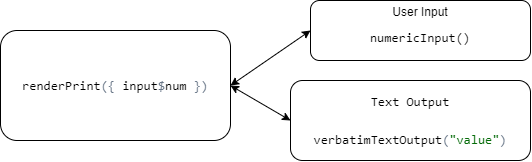

```{r setup, include=FALSE}
options(htmltools.dir.version = FALSE)
```

```{r xaringan-themer, include=FALSE, warning=FALSE}
xaringanthemer::style_duo(
  primary_color = "#025E73",
  secondary_color =  "#F2A341"
)
```
class: inverse, center

#Agenda

--

1.Was ist Shiny

--

2.Frontend/Backend

--

3.Layout  

--

4.Shiny Input/Output  

--

5.Shiny Reactivity

--

6.Abschluss

---
class: inverse, center, middle
#1. Was ist Shiny
---
###Was ist Shiny


<blockquote class="twitter-tweet tw-align-center" data-lang="de"><p lang="en" dir="ltr">You&#39;re doing it right if you get frustrated: if you&#39;re not frustrated, you&#39;re (probably) not stretching yourself mentally</p>&mdash; Hadley Wickham (@hadleywickham) <a href="https://twitter.com/hadleywickham/status/565516733516349441?ref_src=twsrc%5Etfw">11. Februar 2015</a></blockquote>
---
class: inverse, center, middle
#2. Frontend/Backend
---
###Frontend/Backend

---
<iframe 
  src="https://shiny.rstudio.com/gallery/mri-images.html" 
  style="position:absolute; top:0; left:0; bottom:0; right:0; width:100%; height:100vh; border:none; margin:0; padding:0; overflow:hidden; z-index:999999;"> 
</iframe>
---
class: inverse, center, middle
#3. Layout  
---
### Common Layout Options


.left-column[
```{r echo=FALSE, out.height = "525px"}
knitr::include_graphics("https://bookdown.org/weicheng/shinyTutorial/images/layout.png")
```
]

.right-column[
```{r eval=FALSE, echo=TRUE}
library(shiny)

ui <- fluidPage( 
  sidebarLayout(
    sidebarPanel("side panel"),
    mainPanel("main panel")
  )
)

server <- function(input, output) { }

shinyApp(ui = ui, server = server)
```

```{r eval=FALSE, echo=TRUE}
splitLayout("Object 1", "Object 2")
```

```{r eval=FALSE, echo=TRUE}
verticalLayout("Object 1", "Object 2", "Object 3")
```
]
---
### HTML Tags

110 HTML tags can be used with builder functions in RShiny

```{undefined eval=FALSE, echo=TRUE}
Link:           <a href="url">link text</a>  a("link text", href="url")
Image:                  img(src="image.png")
Linebreak:      <br>                         br()
Horizontal Line:<hr>                         hr()
Bold:           <strong>bold text</strong>   strong("bold text")
Italic:         <em>italic text</em>         em("italic text")
Lvl. 1 Header:  <h1>header</h1>              h1("header")
Lvl. 2 Header:  <h2>header</h2>              h2("header")
```


```{undefined eval=FALSE, echo=TRUE}
tags$h1("header") <=> h1("header")
tags$iframe(...)
```

Using the `HTML()` function markes the argument as HTML and formats it accordingly.

CSS and JavaScript files can be linked.
---
### Layout Exercise
  1. Create navbarPage layout with the title `Exercise 2`.
  2. Create tabs called `Plot`, `Leaflet` and `Markdown`:
  3. Create a sidebar layout in the `Plot` tab:
  4. Insert the string `"This is the main panel"` in the main panel.
  5. Insert a picture of the SARS-CoV-2 virus into the side bar panel.
    - Use a builder function with the link provided in the `CoronaVirusImageLink` variable.
    - Set the image width to `100%`
    
    **Bonus**: If you have time, use the `HTML()` function replace the text in the main panel with the picture.

    
---
class: inverse, center, middle
#4. Shiny Input
---
class: center, middle
##Shiny Widgets Gallery

https://shiny.rstudio.com/gallery/widget-gallery.html
---
class: inverse, center, middle
#5. Shiny Output
---
### Shiny Output
Rendering functions are used in application’s server side code, assigning them to outputs that appear in your user interface.

UI Output functions display different kinds of output from the application.

Examples:

- Plot: &nbsp; &nbsp; &nbsp; &nbsp; &nbsp; &nbsp; &nbsp; &nbsp; Server: `renderPlot()` &nbsp; &nbsp; &nbsp; &nbsp; UI: `plotOutput()`

- Table: &nbsp; &nbsp; &nbsp; &nbsp; &nbsp; &nbsp;&nbsp; Server: `renderTable()` &nbsp; &nbsp; &nbsp; UI: `tableOutput()`

- Leaflet: &nbsp; &nbsp; &nbsp; &nbsp; &nbsp;&nbsp; Server: `renderLeaflet` &nbsp; &nbsp; &nbsp; UI: `leafletOutput()`

---
### Basic Shiny App Exercise

+ Use 3 different input functions in the sidebar:
  1. Input for selection of the countries provided
  2. Checkbox input choosing between `"Apple"` and `"Google"` data
  3. Text input for the Title
+ Add the text processing with `renderText()` to the server function
+ Display all 3 elements stored in the output object by the server in the main panel
  1. Format the text as a header
  2. Display the table
  3. Display the plot
---

class: inverse, center, middle
#6. Shiny Reactive
---
class: inverse, center, middle
#Reactivity is where the SHINY Magic happens
---

###Reactivity makes Shiny responisive to User Input. 
-Server Function is "listening" for **Reactive Sources**

-Server sends Information to **Reactive Endpoint**  

https://shiny.rstudio.com/gallery/widget-gallery.html 

```{r echo=FALSE}

```


---
###Reactive Enviroment
Reactive input con only be processed in an "reactive Enviroment"

**Input is not in an reactive Enviroment**
```{r}
server <- function(input, output) {
  # Not an reactive Enviroment
  # Will couse an ERROR
  input      <- input$n #<<
  output$nthValue <- input
}
```

--
**Input is in an reactive Enviroment**
```{r}
server <- function(input, output) {
  output$nthValue <- renderText({ as.character(input$n) }) #<<
}
```
---
###Reactive sources
Reactive Input/ Reactive Values  
-actionButton()  
-checkboxInput()  
-selectInput()  
-textInput()  
-...  

```{r message=FALSE, warning=FALSE}
#UI
library(shiny)
ui <- fluidPage(
  numericInput(inputId ="num", label = h3("Numeric input"), value = 1), #<<
  hr(),
  fluidRow(column(3, verbatimTextOutput(outputId ="value")))
)

```

```{r}
server <- function(input, output) {
  output$nthValue <- renderText({ as.character(input$n) }) #<<
}
```
---
###reactive expressions

-reactive()
-eventReactive()


```{r}
#reactive()
value <- reactive({
  input$num1 + input$num2
})
```

```{r}
#eventReactive()
value <- eventReactive(input$num1, {
  input$num1 + input$num2
  })
```

-Return a value  
-Can react to different Sources  
-Can react to reactive Expressions
---

```{r}
#reactive()
value <- reactive({
  input$num1 + input$num2
})

value2 <- reactive({
  value + input$num3
})
```
---
###observers


---
###reactive Endpoints

---
###Task4 Reactivity

---
class: inverse, center, middle
#7. Abschluss
---
###Deployment
Where to put the finished Shiny App?  

  
--
-Shiny Server  
https://rstudio.com/products/shiny/shiny-server/  

--
-Shiny Proxy  
https://www.shinyproxy.io/  

--
-Shiyapps.io  
https://www.shinyapps.io/  

--

**And thats what we did**  
**https://manuelw.shinyapps.io/SE_Statistic_Shiy_App/**

---

